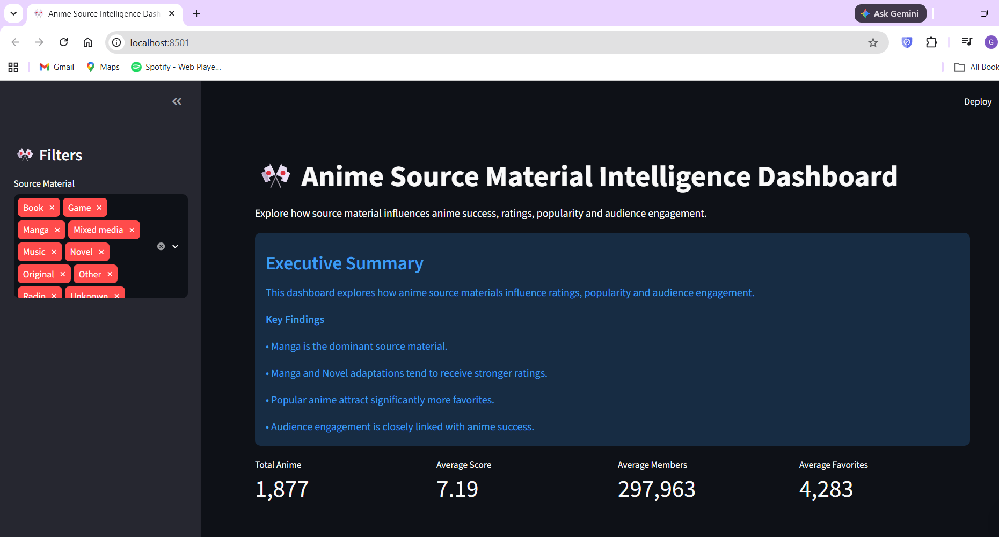
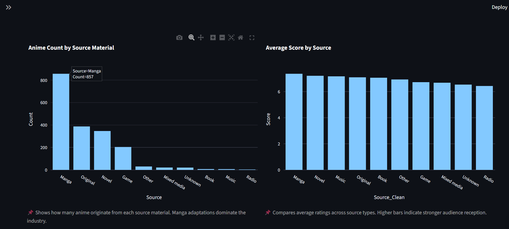
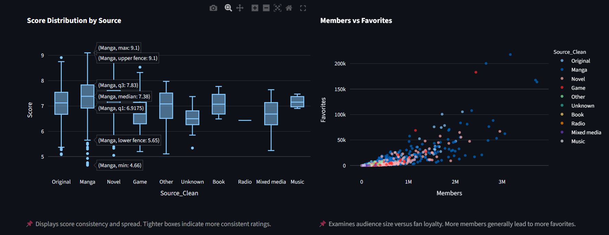
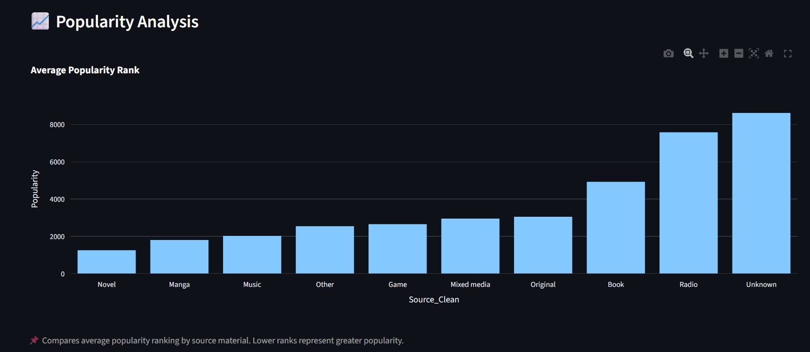
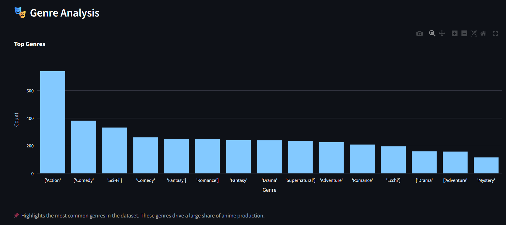
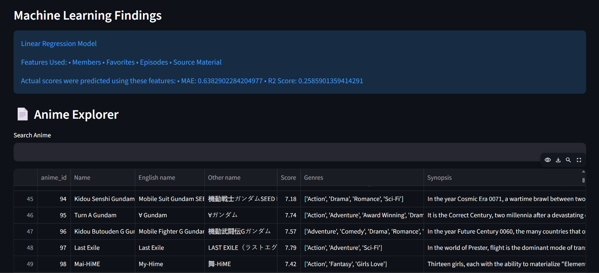
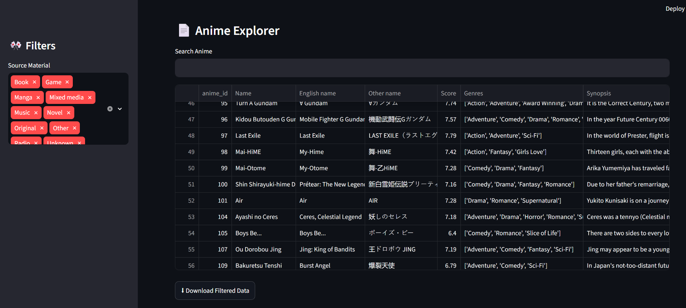

# 🎌 Anime Source Material Intelligence Dashboard

An end-to-end Data Analysis and Machine Learning project exploring whether an anime's source material influences its ratings, popularity, and audience engagement.

---

## 📖 Project Overview

Anime can originate from different source materials such as Manga, Light Novels, Games, Original stories, or Web Manga.

This project investigates whether the source material has a measurable impact on an anime's success using exploratory data analysis, machine learning, and an interactive Streamlit dashboard.

---

## 🎯 Objectives

- Clean and preprocess the Anime Dataset 2023
- Perform Exploratory Data Analysis (EDA)
- Compare different anime source materials
- Analyze audience engagement and popularity
- Build a Linear Regression model to predict anime scores
- Present insights through an interactive dashboard

---

## 🛠 Tech Stack

- Python
- Jupyter Notebook
- Pandas
- NumPy
- Matplotlib
- Seaborn
- Plotly
- Streamlit
- Scikit-learn

---

## 📂 Project Workflow

```text
Raw Dataset
      │
      ▼
Data Cleaning
      │
      ▼
Exploratory Data Analysis
      │
      ▼
Feature Engineering
      │
      ▼
Machine Learning
      │
      ▼
Processed Dataset
      │
      ▼
Interactive Streamlit Dashboard
```

---

## 📊 Dashboard Features

- Interactive source material filter
- KPI cards
- Source material comparison
- Average score analysis
- Score distribution
- Popularity analysis
- Genre analysis
- Members vs Favorites analysis
- Searchable anime explorer
- Download filtered dataset

---

## 🤖 Machine Learning

Model Used:

- Linear Regression

Features:

- Members
- Favorites
- Episodes
- Source Material

Model Performance:

- MAE = 0.638
- R² Score = 0.259

---

## 📁 Folder Structure

```text
anime-source-analysis/
│
├── app.py
├── README.md
├── requirements.txt
├── .gitignore
│
├── data/
│   ├── raw/
│   └── processed/
│
├── notebooks/
│
├── reports/
│
├── sql/
│
└── images/
```

---


---

## 📸 Dashboard Preview
 
 
 
 
 
 

---

## 🚀 How to Run This Project

```bash
git clone https://github.com/YOUR_USERNAME/anime-source-analysis.git
cd anime-source-analysis
pip install -r requirements.txt
streamlit run app.py
---

## 📌 Key Findings

- Manga is the most common source material.
- Manga and Novel adaptations generally achieve higher average scores.
- Audience engagement strongly correlates with popularity.
- Source material alone has limited predictive power for anime ratings.

---

## 👤 Author

**Gurnoor Kaur**

MCA Student | Data Analytics | Machine Learning Enthusiast